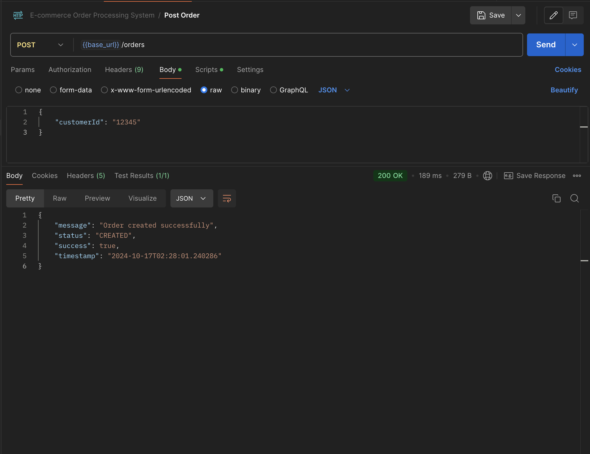
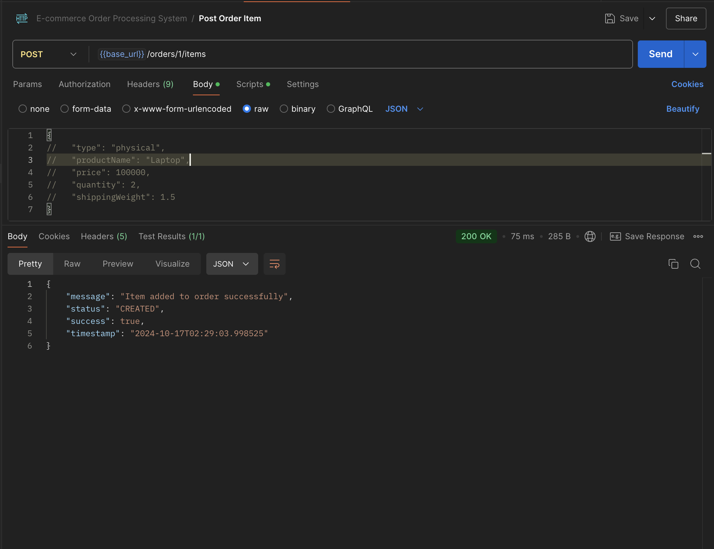
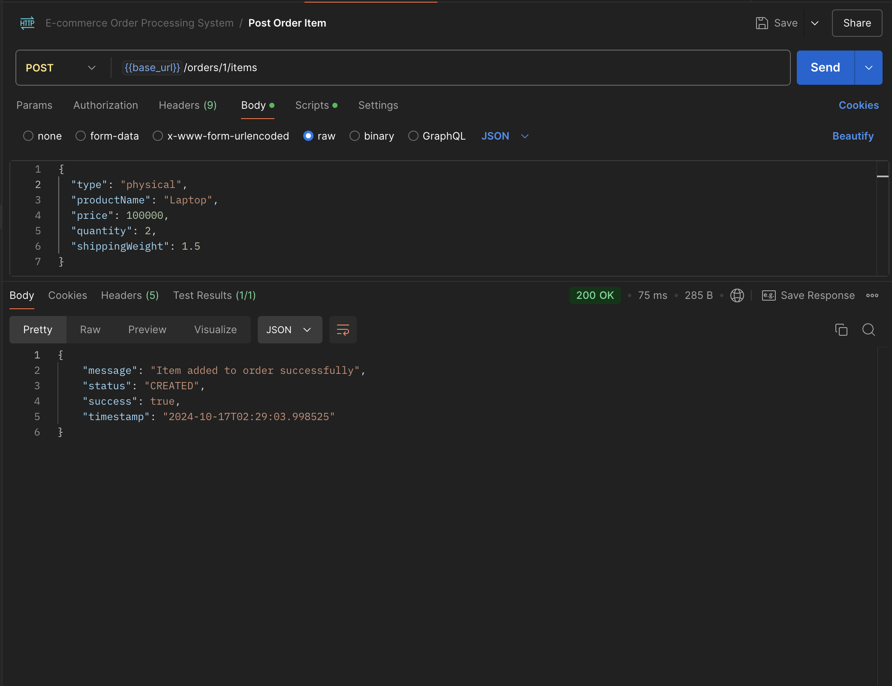
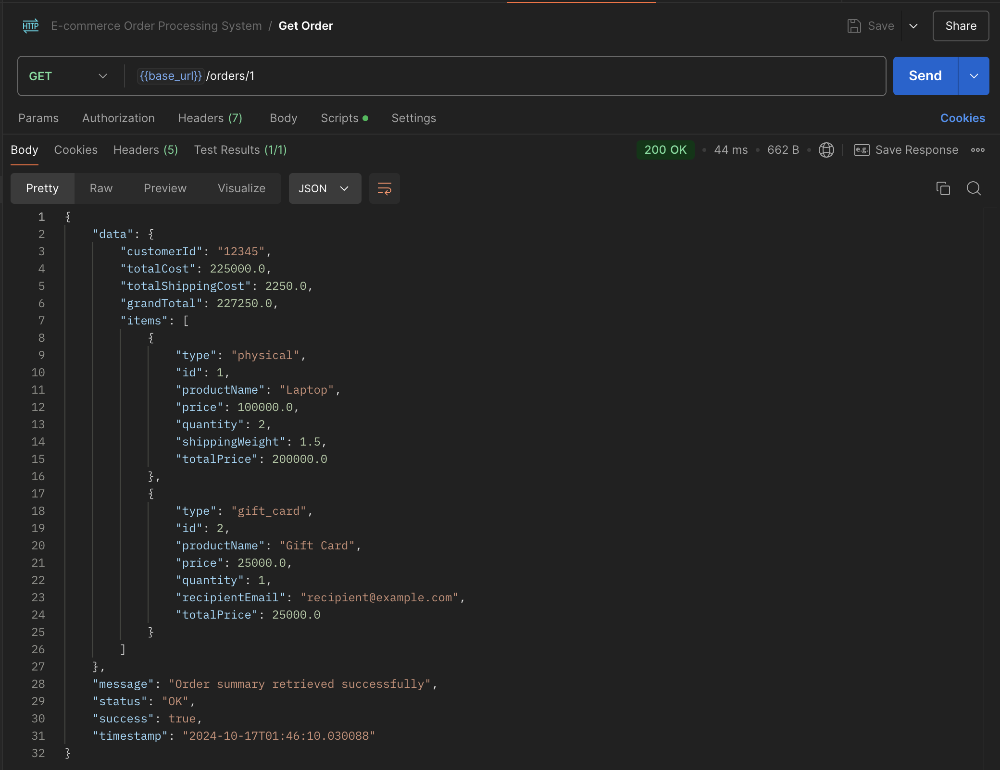

# E-Commerce Order Processing System

## Overview

This project is a basic order processing system for an e-commerce platform. It handles customer orders containing various item types, such as physical products, digital products, and gift cards. The solution focuses on object-oriented principles such as abstraction, inheritance, and polymorphism, offering a clean and extendable design.

## Class Design

### Core OOP Concepts

- **Abstraction**: The `OrderItem` class is an abstract class representing common attributes and methods shared among all types of order items.
- **Inheritance**: `PhysicalProduct`, `DigitalProduct`, and `GiftCard` classes extend `OrderItem` to inherit common behaviors while implementing specific functionalities.
- **Polymorphism**: Each subclass (`PhysicalProduct`, `DigitalProduct`, `GiftCard`) overrides methods like `getTotalPrice()` as needed to support different item-specific behaviors.

### Class Structure

- **`OrderItem`** (abstract class):
    - Attributes: `productName`, `price`, `quantity`.
    - Methods: `double getTotalPrice()`.
- **`PhysicalProduct`**:
    - Additional Attribute: `shippingWeight`.
    - Method: `double calculateShippingCost()`.
- **`DigitalProduct`**:
    - Method: `String generateDownloadLink()`.
- **`GiftCard`**:
    - Additional Attribute: `recipientEmail`.
    - Method: `void sendGift()`.
- **`Order`**:
    - Attributes: `orderId`, `customerId`, `List<OrderItem> items`.
    - Method: `double calculateTotalCost()`.
- **`SummaryDTO`**:
    - Attributes: `orderId`, `totalCost`, `shippingCost`, `items`.
    - Represents the summary of an order with all calculated costs.

### Project Structure
```
src/main/java/com/bella/ecommerce/
├── EcommerceApplication.java
├── models/
│   ├── OrderItem.java
│   ├── PhysicalProduct.java
│   ├── DigitalProduct.java
│   ├── GiftCard.java
│   └── Order.java
├── controllers/
│   └── OrderController.java
│   └── MainController.java
├── repositories/
│   └── OrderRepository.java
│   └── OrderItemRepository.java
├── services/
│  └── OrderService.java
│  └── impl/
│     └── OrderServiceImpl.java
├── utils/
│   └── ApiResponse.java
├── exceptions/
│   └── BadRequestException.java
│   └── GlobalExceptionHandler.java
├── validators/
│   └── EmailValidator.java
│   └── TypeValidator.java
│   └── ValidEmail.java
│   └── ValidType.java
└── dtos/
    ├── CreateOrderDTO.java
    └── CreateOrderItemDTO.java
    └── SummaryDTO.java

```

## API Design

### 1. Create a New Order

- **HTTP Method**: `POST`
- **URL**: `/orders`
- **Request Body**:
    ```json
    {
      "customerId": "12345"
    }
    ```
  - **Response**:
      ```json
    {
        "message": "Order created successfully",
        "status": "CREATED",
        "success": true,
        "timestamp": "2024-10-17T02:28:01.240286"
    }
      ```

### 2. Add Item to an Order

- **HTTP Method**: `POST`
  - **URL**: `/orders/{orderId}/items`
  - **Request Body**:
      ```json
      {
         "type": "physical", 
         "productName": "Laptop",
         "price": 100000,
         "quantity": 2,
         "shippingWeight": 1.5
      }
      ```
- **Response**:
    ```json
    {
      "message": "Item added to order successfully",
      "status": "CREATED",
      "success": true,
      "timestamp": "2024-10-17T02:28:01.240286"
    }
    ```

### 3. Retrieve Order Summary

- **HTTP Method**: `GET`
- **URL**: `/orders/{orderId}`
  - **Response**:
      ```json
      {
          "data": {
              "customerId": "12345",
              "totalCost": 200000.0,
              "totalShippingCost": 2250.0,
              "grandTotal": 202250.0,
              "items": [
                  {
                      "type": "physical",
                      "id": 1,
                      "productName": "Laptop",
                      "price": 100000.0,
                      "quantity": 2,
                      "shippingWeight": 1.5,
                      "totalPrice": 200000.0
                  }
              ]
          },
          "message": "Order summary retrieved successfully",
          "status": "OK",
          "success": true,
          "timestamp": "2024-10-17T02:29:09.414690"
      }
      ```

## Design Decisions

1. **Abstract `OrderItem` Class**: The `OrderItem` class is abstract to ensure that no generic order item can be created. This ensures that every item added to an order is either a `PhysicalProduct`, `DigitalProduct`, or `GiftCard`, each with its own specific behavior.
2. **Use of Polymorphism**: The design enables flexibility when calculating the total price for each item, as each type can override the `getTotalPrice()` method if necessary.
3. **Separation of Concerns**: The `OrderServiceImpl` handles business logic related to order creation, item addition, and order summary retrieval, while the `OrderController` manages HTTP requests and responses.
4. **Scalability**: The use of interfaces and abstract classes ensures that new item types can be added with minimal changes to the existing code. For instance, adding a new item type like `SubscriptionProduct` would involve creating a new class extending `OrderItem` and implementing specific methods.

## Testing Instructions

## Setting Up the PostgreSQL Database

1. **Install PostgreSQL** if you haven't already, and create a database:
    ```sql
    CREATE DATABASE ordersystem;
    ```

2. **Configure database connection** in `src/main/resources/application.properties`:
    ```properties
    spring.datasource.url=jdbc:postgresql://localhost:5432/ordersystem
    spring.datasource.username=your_db_username
    spring.datasource.password=your_db_password
    spring.jpa.hibernate.ddl-auto=create
    spring.jpa.properties.hibernate.dialect=org.hibernate.dialect.PostgreSQLDialect
    server.port=8090
    ```

3. **Run database migrations** (if using tools like Flyway or Liquibase) or allow Hibernate to create tables automatically based on your entity classes.

## Cloning and Running the Application

1. **Clone the repository**:
    ```bash
    git clone https://github.com/Bellamy01/ecommerce.git
    cd ecommerce
    ```

2. **Build the project** using Maven:
    ```bash
    mvn clean install
    ```

3. **Run the application**:
    ```bash
    mvn spring-boot:run
    ```

4. The application will run on [http://localhost:8090](http://localhost:8090).

## API Testing Using Postman and curl

### 1. Create a New Order

- **Using Postman**:
    - Method: `POST`
    - URL: `http://localhost:8090/orders`
    - Body (JSON):
        ```json
        {
          "customerId": "12345"
        }
        ```
    - Click "Send" and verify the response.

- **Using curl**:
    ```bash
    curl -X POST http://localhost:8090/orders -H "Content-Type: application/json" -d '{"customerId": "12345"}'
    ```

### 2. Add Item to an Order

- **Using Postman**:
    - Method: `POST`
    - URL: `http://localhost:8090/orders/1/items`
    - Body (JSON):
        ```json
        {
          "type": "PHYSICAL",
          "productName": "Laptop",
          "price": 1000.0,
          "quantity": 1,
          "shippingWeight": 2.5
        }
        ```
    - Click "Send" and verify the response.

- **Using curl**:
    ```bash
    curl -X POST http://localhost:8090/orders/1/items -H "Content-Type: application/json" -d '{"type": "PHYSICAL", "productName": "Laptop", "price": 1000.0, "quantity": 1, "shippingWeight": 2.5}'
    ```

### 3. Retrieve Order Summary

- **Using Postman**:
    - Method: `GET`
    - URL: `http://localhost:8090/orders/1`
    - Click "Send" and verify the response.

- **Using curl**:
    ```bash
    curl -X GET http://localhost:8090/orders/1
    ```

###  Check if app is running


###  Create order in Postman


###  Testing item creation in postman


###  Add item to order in postman


###  Retrieve order summary in postman


## Conclusion

Feel free to add any additional information or context about the project here. You can discuss the challenges you faced, the lessons you learned, or the next steps you plan to take.
